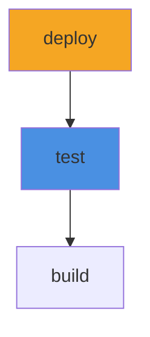

# CLI Reference

The `wetwire-github` command provides tools for generating and validating GitHub Actions workflows from typed Python declarations.

## Quick Reference

| Command | Description |
|---------|-------------|
| `wetwire-github build` | Generate YAML from Python declarations |
| `wetwire-github validate` | Validate generated YAML via actionlint |
| `wetwire-github list` | List discovered workflows and jobs |
| `wetwire-github lint` | Apply code quality rules (WAG001-WAG008) |
| `wetwire-github import` | Convert existing workflow YAML to Python code |
| `wetwire-github init` | Create new project with example workflow |
| `wetwire-github design` | AI-assisted workflow design |
| `wetwire-github test` | Persona-based testing |
| `wetwire-github graph` | Generate DAG visualization of workflow jobs |
| `wetwire-github action` | Generate action.yml from composite actions |
| `wetwire-github mcp-server` | Start MCP server for AI agent integration |

```bash
wetwire-github --version  # Show version
wetwire-github --help     # Show help
```

> **Note**: When developing with uv, prefix commands with `uv run`:
> ```bash
> uv run wetwire-github build ci/
> ```

---

## build

Generate GitHub Actions YAML from Python workflow declarations.

```bash
# Build from a package path (simplest)
wetwire-github build ci/

# Build with specific output directory
wetwire-github build ci/ -o .github/workflows/

# Build Dependabot configuration
wetwire-github build ci/ --type dependabot

# Build issue templates
wetwire-github build ci/ --type issue-template

# Output as JSON instead of YAML
wetwire-github build ci/ --format json
```

### Options

| Option | Description |
|--------|-------------|
| `PACKAGE` | Path to Python package containing workflow declarations |
| `--output, -o PATH` | Output directory (default: `.github/workflows/`) |
| `--format, -f {yaml,json}` | Output format (default: yaml) |
| `--type, -t TYPE` | Config type: `workflow`, `dependabot`, or `issue-template` |

### How It Works

1. Discovers Python files in the specified package
2. Finds `Workflow` instances using AST-based discovery
3. Validates workflow structure and references
4. Serializes to GitHub Actions YAML format
5. Writes to output directory

### Output Structure

```yaml
name: CI
on:
  push:
    branches: [main]
  pull_request:
    branches: [main]

jobs:
  build:
    runs-on: ubuntu-latest
    steps:
      - uses: actions/checkout@v4
      - run: make build
```

---

## validate

Validate generated workflow YAML using actionlint.

```bash
# Validate specific files
wetwire-github validate .github/workflows/ci.yml

# Validate multiple files
wetwire-github validate .github/workflows/*.yml

# Output as JSON
wetwire-github validate .github/workflows/ --format json
```

### Options

| Option | Description |
|--------|-------------|
| `FILES` | YAML files to validate |
| `--format, -f {text,json}` | Output format (default: text) |

### Requirements

Requires [actionlint](https://github.com/rhysd/actionlint) to be installed:

```bash
# macOS
brew install actionlint

# Linux
go install github.com/rhysd/actionlint/cmd/actionlint@latest
```

### Output Example

```
.github/workflows/ci.yml:12:9: property "pyton-version" is not defined in object type
```

---

## list

List discovered workflows and jobs from Python packages.

```bash
# List workflows in package
wetwire-github list ci/

# Output as JSON
wetwire-github list ci/ --format json
```

### Options

| Option | Description |
|--------|-------------|
| `PACKAGE` | Path to Python package (default: current directory) |
| `--format, -f {table,json}` | Output format (default: table) |

### Output Example (Table)

```
Workflows:
  ci (ci/workflows.py:15)
    Jobs: build, test, deploy

  release (ci/workflows.py:45)
    Jobs: publish
```

### Output Example (JSON)

```json
{
  "workflows": [
    {
      "name": "ci",
      "file": "ci/workflows.py",
      "line": 15,
      "jobs": ["build", "test", "deploy"]
    }
  ]
}
```

---

## lint

Apply code quality rules (WAG001-WAG008) to workflow declarations.

```bash
# Lint package
wetwire-github lint ci/

# Lint and auto-fix
wetwire-github lint ci/ --fix

# Output as JSON
wetwire-github lint ci/ --format json
```

### Options

| Option | Description |
|--------|-------------|
| `PACKAGE` | Path to Python package (default: current directory) |
| `--fix` | Automatically fix fixable issues |
| `--format, -f {text,json}` | Output format (default: text) |

### Rules

| Rule | Description | Auto-fix |
|------|-------------|----------|
| WAG001 | Use typed action wrappers instead of raw strings | No |
| WAG002 | Use condition builders instead of raw expressions | No |
| WAG003 | Use secrets context for secrets access | Yes |
| WAG004 | Use Matrix builder for matrix configurations | No |
| WAG005 | Extract inline environment variables | No |
| WAG006 | Detect duplicate workflow names | No |
| WAG007 | Flag oversized files (too many jobs) | No |
| WAG008 | Avoid hardcoded expressions | No |

### Output Example

```
ci/workflows.py:23:12: WAG001 Use typed action wrapper instead of raw 'uses' string
ci/workflows.py:31:8: WAG003 Use Secrets.get() instead of raw secrets expression (auto-fixable)

Found 2 issues (1 auto-fixable)
```

---

## import

Convert existing GitHub Actions YAML to typed Python declarations.

```bash
# Import a single workflow
wetwire-github import .github/workflows/ci.yml

# Import to specific directory
wetwire-github import .github/workflows/ci.yml -o ci/

# Import as single file
wetwire-github import .github/workflows/*.yml --single-file

# Skip project scaffolding
wetwire-github import .github/workflows/ci.yml --no-scaffold

# Import Dependabot configuration
wetwire-github import .github/dependabot.yml --type dependabot
```

### Options

| Option | Description |
|--------|-------------|
| `FILES` | YAML files to import |
| `--output, -o PATH` | Output directory for generated Python code |
| `--single-file` | Generate all code in a single file |
| `--no-scaffold` | Skip project scaffolding (pyproject.toml, etc.) |
| `--type, -t TYPE` | Config type: `workflow`, `dependabot`, or `issue-template` |

### Generated Code Example

Input YAML:
```yaml
name: CI
on:
  push:
    branches: [main]
jobs:
  build:
    runs-on: ubuntu-latest
    steps:
      - uses: actions/checkout@v4
      - run: make build
```

Generated Python:
```python
from wetwire_github.workflow import Workflow, Job, Step, Triggers, PushTrigger
from wetwire_github.actions import checkout

build_job = Job(
    runs_on="ubuntu-latest",
    steps=[
        checkout(),
        Step(run="make build"),
    ],
)

ci = Workflow(
    name="CI",
    on=Triggers(push=PushTrigger(branches=["main"])),
    jobs={"build": build_job},
)
```

---

## init

Scaffold a new wetwire-github project structure.

```bash
# Create new project
wetwire-github init my-ci

# Create in specific directory
wetwire-github init my-ci -o projects/
```

### Options

| Option | Description |
|--------|-------------|
| `NAME` | Project name |
| `--output, -o PATH` | Output directory (default: current directory) |

### Generated Structure

```
my-ci/
├── __init__.py
├── workflows.py      # Example workflow
└── pyproject.toml    # Project configuration
```

### Example Workflow Generated

```python
"""Example GitHub Actions workflow."""

from wetwire_github.workflow import Workflow, Job, Step, Triggers, PushTrigger
from wetwire_github.actions import checkout

build_job = Job(
    runs_on="ubuntu-latest",
    steps=[
        checkout(),
        Step(run="echo 'Hello, World!'"),
    ],
)

ci = Workflow(
    name="CI",
    on=Triggers(push=PushTrigger(branches=["main"])),
    jobs={"build": build_job},
)
```

---

## design

AI-assisted workflow design using wetwire-core.

```bash
# Start interactive design session
wetwire-github design

# With streaming output
wetwire-github design --stream

# Limit lint feedback cycles
wetwire-github design --max-lint-cycles 5

# Use Kiro CLI provider instead of Anthropic API
wetwire-github design --provider kiro

# Use Kiro with an initial prompt
wetwire-github design --provider kiro --prompt "Create a CI workflow for Python"
```

### Options

| Option | Description |
|--------|-------------|
| `--stream` | Enable streaming output |
| `--max-lint-cycles N` | Maximum lint feedback cycles (default: 3) |
| `-p, --provider` | AI provider: `anthropic` (default) or `kiro` |
| `--prompt` | Initial prompt for design session |
| `-o, --output` | Output directory for generated workflows |

### Requirements

- **Anthropic provider** (default): Requires `wetwire-core` and `ANTHROPIC_API_KEY` environment variable.
- **Kiro provider**: Requires Kiro CLI to be installed.

### How It Works

1. You describe what workflow you need
2. AI generates typed Python workflow declarations
3. Code is automatically linted and fixed
4. You review and iterate
5. Final code is ready for use

### Example Session

```
You: I need a CI workflow that runs tests on Python 3.11 and 3.12

AI: Creating workflow with matrix build...
    Generated: ci/workflows.py
    Lint: PASS

Files created:
  ci/__init__.py
  ci/workflows.py
```

---

## test

Run persona-based tests for code generation quality.

```bash
# Run with specific persona
wetwire-github test --persona beginner

# Run with scenario file
wetwire-github test --scenario scenarios/ci-workflow.yaml

# Use Kiro CLI provider for testing
wetwire-github test --provider kiro --workflow .github/workflows/ci.yml

# Test all personas against a workflow
wetwire-github test --all --workflow .github/workflows/ci.yml
```

### Options

| Option | Description |
|--------|-------------|
| `--persona NAME` | Persona to use: `beginner`, `intermediate`, `expert`, `terse`, `verbose` |
| `--workflow FILE` | Workflow YAML file to test |
| `--threshold N` | Score threshold for pass/fail (default: 70) |
| `--all` | Run all personas against the workflow |
| `--scenario FILE` | Scenario configuration file |
| `-p, --provider` | AI provider: `anthropic` (default) or `kiro` |

### Requirements

- **Anthropic provider** (default): Requires `wetwire-core` and `ANTHROPIC_API_KEY` environment variable.
- **Kiro provider**: Requires Kiro CLI to be installed.

### Available Personas

The test command supports two categories of personas:

**Domain Personas** (workflow quality focus):

| Persona | Description |
|---------|-------------|
| `reviewer` | Code reviewer focused on maintainability and best practices |
| `senior-dev` | Senior developer focused on reliability and performance |
| `security` | Security engineer focused on supply chain and access control |
| `beginner` | New developer learning GitHub Actions |

**Spec-Standard Personas** (per WETWIRE_SPEC.md Section 7):

| Persona | Description |
|---------|-------------|
| `expert` | Deep knowledge, precise requirements, minimal hand-holding |
| `terse` | Minimal information, expects system to infer defaults |
| `verbose` | Over-explains, buries requirements in prose |

---

## graph

Generate a dependency graph of workflow jobs in DOT or Mermaid format.

```bash
# Generate Mermaid format (default)
wetwire-github graph ci/

# Generate DOT format
wetwire-github graph ci/ --format dot

# Save to file
wetwire-github graph ci/ -o workflow.md

# Filter to show only specific jobs
wetwire-github graph ci/ --filter "test*"

# Exclude certain jobs from the graph
wetwire-github graph ci/ --exclude "deploy*"

# Include a legend explaining color scheme
wetwire-github graph ci/ --legend

# Combine filters and legend
wetwire-github graph ci/ --filter "*test*" --legend -o test-jobs.md

# Render DOT to PNG (requires graphviz)
wetwire-github graph ci/ --format dot | dot -Tpng -o workflow.png
```

### Options

| Option | Description |
|--------|-------------|
| `PACKAGE` | Path to Python package (default: current directory) |
| `--format, -f {dot,mermaid}` | Output format (default: mermaid) |
| `--output, -o FILE` | Output file |
| `--filter PATTERN` | Filter pattern to show only matching jobs (glob pattern) |
| `--exclude PATTERN` | Exclude pattern to hide matching jobs (glob pattern) |
| `--legend` | Include a legend explaining the color scheme |

### Color Coding

The graph visualization uses color coding to highlight different job types:

- **Blue** - Jobs with matrix builds
- **Yellow** - Jobs with conditional execution (`if` conditions)
- **Green** - Jobs calling reusable workflows
- **Orange** - Dependency edges (job relationships)

Use `--legend` to include this information directly in the output.

### Mermaid Output Example



### DOT Output Example


---

## action

Generate action.yml files from typed Python composite action declarations.

The `action` command provides subcommands for working with composite GitHub Actions.

### action build

Generate action.yml files from Python composite action declarations.

```bash
# Build from a package path (simplest)
wetwire-github action build ci/

# Build with specific output directory
wetwire-github action build ci/ -o actions/my-action/

# Build from current directory
wetwire-github action build
```

#### Options

| Option | Description |
|--------|-------------|
| `PACKAGE` | Path to Python package containing action declarations (default: current directory) |
| `--output, -o PATH` | Output directory (default: `.`) |

#### How It Works

1. Discovers Python files in the specified package
2. Finds `CompositeAction` instances using AST-based discovery
3. Validates action structure (name, description, runs, inputs, outputs)
4. Serializes to GitHub Actions action.yml format
5. Writes to output directory

#### Python Declaration Example

```python
from wetwire_github.composite import (
    CompositeAction,
    CompositeRuns,
    ActionInput,
    ActionOutput,
)
from wetwire_github.workflow import Step

my_action = CompositeAction(
    name="Setup Python Project",
    description="Install Python and dependencies",
    inputs={
        "python-version": ActionInput(
            description="Python version to use",
            required=True,
        ),
        "cache": ActionInput(
            description="Enable dependency caching",
            default="true",
        ),
    },
    outputs={
        "cache-hit": ActionOutput(
            description="Whether cache was restored",
            value="${{ steps.cache.outputs.cache-hit }}",
        ),
    },
    runs=CompositeRuns(
        steps=[
            Step(
                uses="actions/setup-python@v5",
                with_={
                    "python-version": "${{ inputs.python-version }}",
                },
            ),
            Step(
                id="cache",
                uses="actions/cache@v4",
                with_={
                    "path": "~/.cache/pip",
                    "key": "pip-${{ inputs.python-version }}",
                },
                shell="bash",
            ),
            Step(
                run="pip install -r requirements.txt",
                shell="bash",
            ),
        ],
    ),
)
```

#### Generated action.yml

```yaml
name: Setup Python Project
description: Install Python and dependencies

inputs:
  python-version:
    description: Python version to use
    required: true
  cache:
    description: Enable dependency caching
    default: 'true'

outputs:
  cache-hit:
    description: Whether cache was restored
    value: ${{ steps.cache.outputs.cache-hit }}

runs:
  using: composite
  steps:
    - uses: actions/setup-python@v5
      with:
        python-version: ${{ inputs.python-version }}
    - id: cache
      uses: actions/cache@v4
      with:
        path: ~/.cache/pip
        key: pip-${{ inputs.python-version }}
      shell: bash
    - run: pip install -r requirements.txt
      shell: bash
```

#### Use Cases

- **Reusable setup steps** - Package common setup logic as composite actions
- **Cross-repository sharing** - Share actions between multiple repositories
- **Typed declarations** - Define actions using typed Python instead of raw YAML
- **Local actions** - Create local actions in `.github/actions/` directories

#### Example Project Structure

```
my-project/
├── actions/
│   ├── __init__.py
│   └── setup.py          # CompositeAction declarations
└── .github/
    └── actions/
        └── setup-python/
            └── action.yml  # Generated output
```

---

## mcp-server

Start the Model Context Protocol (MCP) server for AI agent integration.

```bash
# Start MCP server
wetwire-github mcp-server
```

The MCP server enables AI tools like Kiro CLI to interact with wetwire-github commands programmatically.

### Available Tools

The MCP server exposes the following tools:

| Tool | Description |
|------|-------------|
| `wetwire_init` | Create a new project |
| `wetwire_build` | Generate YAML from Python declarations |
| `wetwire_lint` | Run code quality rules |
| `wetwire_validate` | Validate YAML via actionlint |
| `wetwire_import` | Convert YAML to Python |
| `wetwire_list` | List discovered workflows |
| `wetwire_graph` | Generate dependency graphs |

### Installation

The MCP server requires the optional `mcp` dependency:

```bash
# Install with MCP support
pip install wetwire-github[mcp]

# Or with uv
uv pip install wetwire-github[mcp]
```

### Usage with AI Tools

Configure your AI tool to use the MCP server. For example, with Kiro CLI:

```json
{
  "mcpServers": {
    "wetwire-github": {
      "command": "wetwire-github",
      "args": ["mcp-server"]
    }
  }
}
```

---

## Exit Codes

| Code | Meaning |
|------|---------|
| 0 | Success |
| 1 | Error (validation failed, lint issues, etc.) |
| 2 | Usage error (invalid arguments) |

---

## Environment Variables

| Variable | Description |
|----------|-------------|
| `ANTHROPIC_API_KEY` | Required for `design` and `test` commands |

---

## See Also

- [Quick Start](QUICK_START.md) - Getting started guide
- [Lint Rules](LINT_RULES.md) - Detailed lint rule documentation
- [Examples](EXAMPLES.md) - Usage examples
- [Wetwire Specification](https://github.com/lex00/wetwire/blob/main/docs/WETWIRE_SPEC.md) - Core patterns
